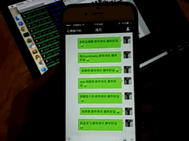

# wechat-sendall
过年了，给好友群发微信祝福过年吧，加上好友的名字，诚意十足，居家必备。

目前只做到够用，代码很乱，欢迎补充。

# 效果图


# 使用

```
$ pip install -r requirements.txt
$ python mychat.py -h
Usage: mychat.py [options]

send custom message to your friend on wechat, default dry run

Options:
  -h, --help            show this help message and exit
  -s, --sendall         send message to your friend, please double check
  -p PORT, --port=PORT  http server port listen


$ python mychat.py
[+] Getting QR Image...
[+] Please open http://192.168.1.117/qrcode.jpg or open /var/www/html/qrcode.jpg
[+] Scan success, please click confirm on your mobile phone
[+] Logging in ...
[+] Login success
[+] sending to xiao ...
[*] Send to yourself success.

```
默认将登录二维码放在当前工作目录，点开URL，扫描登录。或者直接打开文件。

*注意1*
```
$ python mychat.py -s
```
默认只发给自己，打开了'-s'就给好友发祝福了，同时也给自己发一遍。
确认发给自己没问题了，再发出去噢。。。。要不闹笑话了。

*注意2*
记得提前备注好好友的名字，没有备注的话使用昵称。

*注意3*
默认随机祝福喔，可以替换成自己的话。修改regards.txt文件即可，每行一句。随机选择一行。

*注意4*
格式控制代码，可以修改代码来自定义。

```
# content="嗨, %s 新年快乐 %s" % (name, "[拥抱]")
content="嗨, %s, %s %s" % (name, getRandomMsg(), "[拥抱]")
```

# 测试
支持Windows, Linux, MAC.

# 存在的问题
1. 部分帐号存在不能给自己发送的问题，一般直接登录web 微信也存在这个问题，不知道什么原因。
2. 部分消息会没有发送出去，当前没有做重试。

# 感谢
登录部分借鉴https://github.com/0x5e/wechat-deleted-friends
感谢。

